# Solution

## Tasks

- Deploy a Subnet.

## Steps

1. Subnet Creation

2. Deploy Subnet

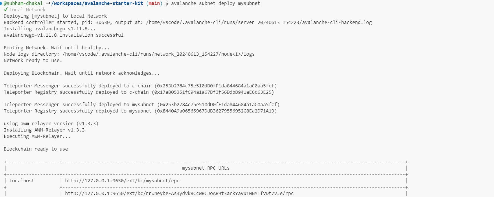
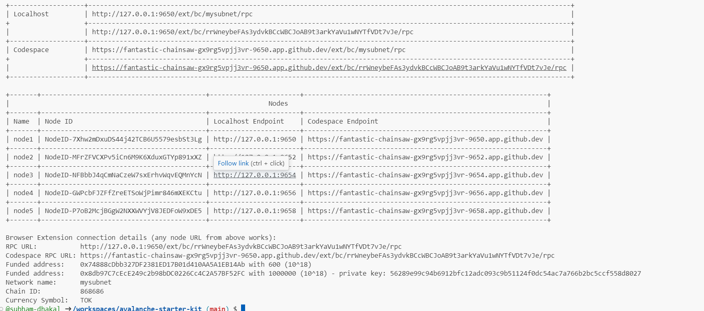

3. Describe Subnet for Blockchain ID

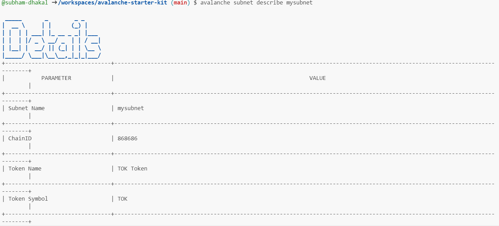
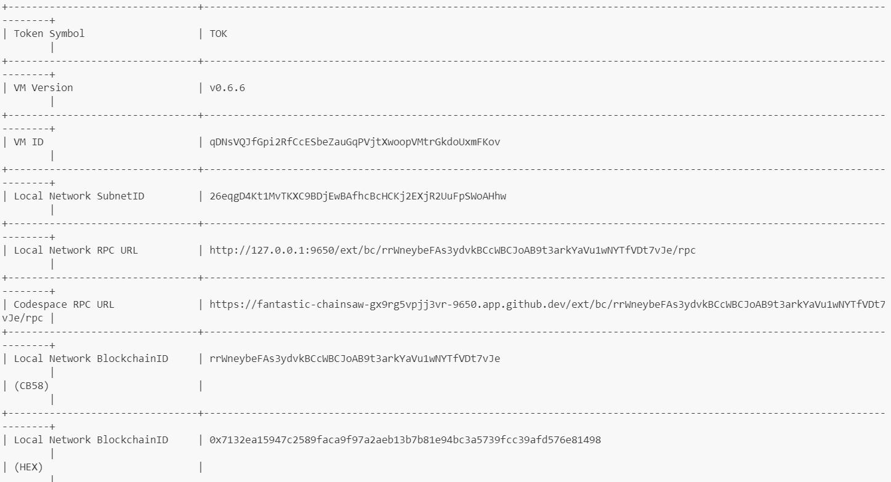
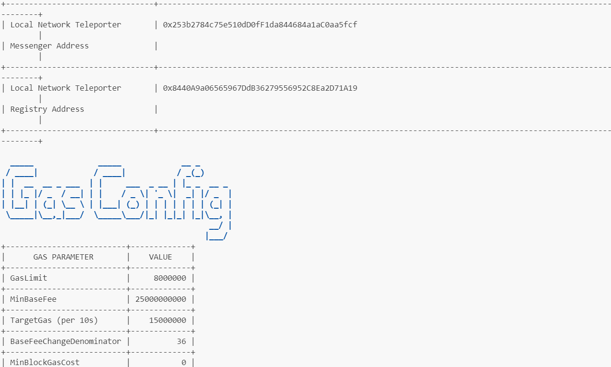
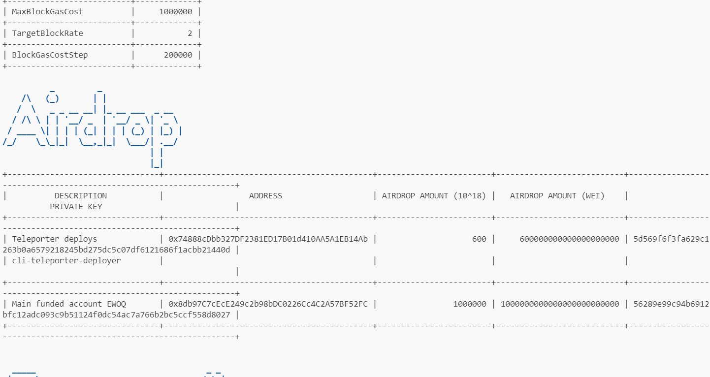
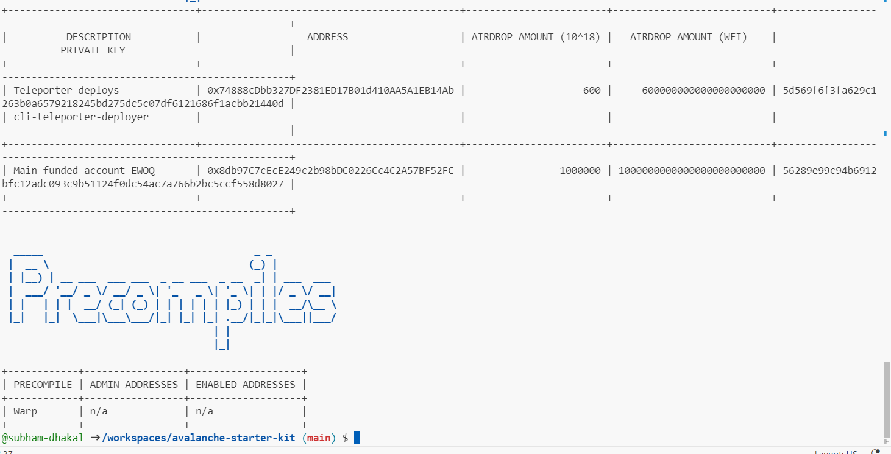

4. Deploy Sender Contract for message sending

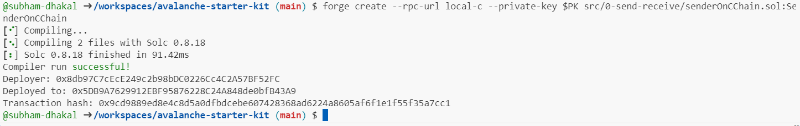

5. Deploy Receiver Contract for message receiving

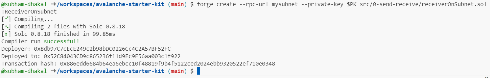

6. Send message from sender to receiver

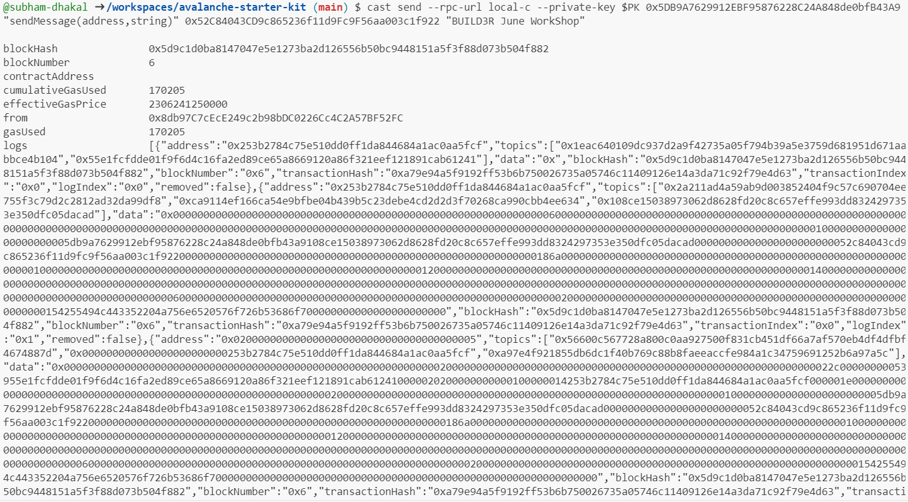
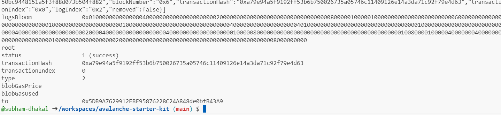
Txn Hash: 0xa79e94a5f9192ff53b6b750026735a05746c11409126e14a3da71c92f79e4d63

7. Verify Message on Receiver end

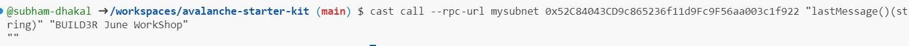

Txn Hash:
0x886edd6684b64ea6ebcc10f48819f9b4f5122ced2024ebb9320522ef710e0348
